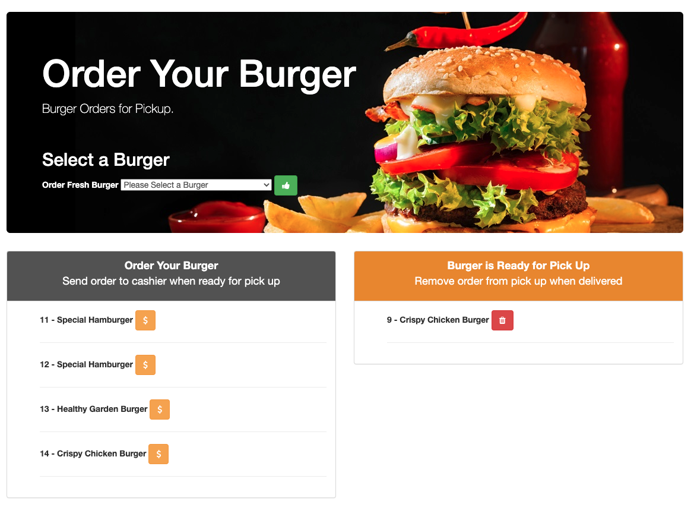

# Eat-Da-Burger

## Functional Features
1. Eat-Da-Burger is a restaurant app that helps users input the names of burgers they'd like to eat.

2. Whenever a user submits a burger's name, the app will display the burger on the left side of the page.

3. Each burger in the waiting area also has a Devour button. On click devour button, the burger will move to the right side of the page.

4. On click delete/trash button the burger will be deleted from the list.

5. The app will store every burger in a database, whether devoured or not.

## Technical Features:

1. The app was build with node, express, and handlebars.

2. My SQL data was used to store the data.

## Image
</a>

## Link to the application deployed in Heroku
<a href = "https://murmuring-bayou-20419.herokuapp.com/" target ="_blank">Please click here to see the deployed application</a>
